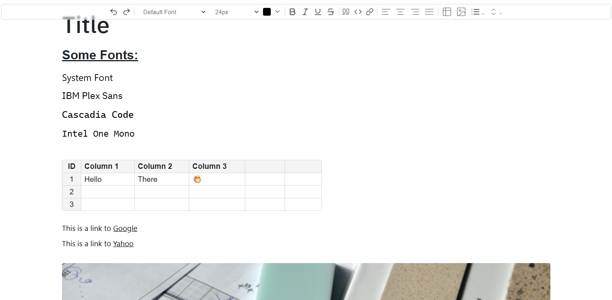

# Tiptap Demo

A modern rich text editor demo built with [Tiptap](https://tiptap.dev/), Tailwind CSS, and Tailwind Plus Elements. This project demonstrates a customizable editor UI with formatting controls.



## Features

- **Rich Text Editing** powered by Tiptap
- **Customizable Toolbar** with undo/redo, font, size, color, alignment, and formatting controls
- **Responsive Design** using Tailwind CSS
- **Modern UI** with backdrop blur, shadows, and custom fonts

---

### Demo
You can try the live demo of the editor at [tip-tap-demo.vercel.app](https://tip-tap-demo.vercel.app/)

---

### Installation

1. **Clone the repository:**
   ```bash
   git clone https://github.com/bukh-sal/tip_tap_demo
   cd tip_tap_demo
   ```

2. **Install dependencies:**
   ```bash
   npm install
   ```

3. **Run the development server:**
   ```bash
   npm run dev
   ```

4. **Open your browser** and navigate to `http://localhost:5173/` to see the editor in action.

